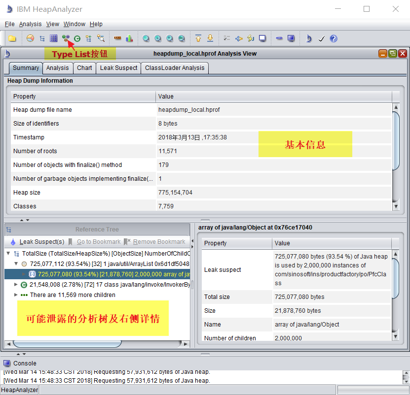
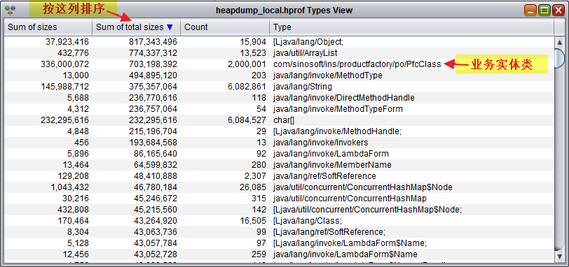

# Java程序宕机或缓慢分析指南

Java程序在生产环境中，有时会出现宕机或响应非常缓慢的情况。本篇主要针对这种情况下的基本问题分析方法进行一下介绍。

## 1. 常见的造成系统缓慢的可能原因

系统宕机或响应缓慢，一般都是由于某种系统资源不足导致的。

Java WEB程序中主要的系统资源是：

1. 内存
2. CPU
3. 连接池中的数据库连接
4. 中间件WEB请求线程池中的线程

而可能导致资源不足的原因常见有以下几种：

1. 数据库连接未关闭（泄露），导致连接池中连接耗尽。
2. 数据库SQL执行时间过长，用户反复操作，导致连接池连接耗尽，或WEB线程池中线程耗尽。
3. SQL提取数据过多，导致内存溢出，同时因为提取数据多就一定会慢，所以也会导致用户反复操作，和第二点类似。
4. 系统某个非数据库的常用操作耗时较长，用户反复操作，导致WEB线程耗尽。
5. 系统某个操作有同步锁，且耗时稍长，引起后面等待锁的线程堆积起来导致WEB线程耗尽。
6. 解析大文件等过程中导致内存溢出的。
7. 系统中逻辑不当造成死循环之类的，导致CPU居高不下，系统缓慢直至宕机。
8. JDK8以前的版本PermSize配置不够大，而加载的类过多（有时热部署机制容易导致此类问题）时导致Perm内存不够，系统宕机。这种一般日志里面有很明确的报错信息的，只要看到报错信息是Perm相关的一般就能确诊。

## 2. 系统缓慢或宕机原因分析概述

发生系统缓慢或宕机情况，要分析其原因，做重要的是首先收集系统信息。

有以下几点信息是需要收集的：

1. 明确一下当时的具体现象，是完全无法访问，还是系统很慢但还偶尔能用，是所有功能都慢，还是某几个功能尚可某些功能特别慢等。
2. 系统参数，如Java版本，启动参数中配置的内存配置（-Xms, -Xmx, -PermSize等参数）。
3. 系统当时的整体情况，如CPU消耗，内存消耗等。这些一般可以通过Linux命令，如top（查CPU及进程），free（查内存）命令等获取。
4. JVM的运行情况，一般如果生产环境有任何监控类的工具的话，就能提取到JVM本身的CPU消耗和内存消耗图表。
5. WEB中间件的一些监控信息，如WEB线程池中线程数，排队数，还有数据源连接池连接数，可用数，排队数等等。
6. 如果有DBA支持，提取一下当时数据库的连接信息，如各个客户端的连接数，总连接数，允许的总连接数限制，是否有突出的SQL执行问题（比如全表扫描）等。
7. 取若干个threaddump文件，后面专题讲。
8. 如果感觉有可能是内存溢出问题，取heapdump文件，后面专题讲。
9. 系统日志，特别是报错信息等。

实际情况下不一定能全部收集到上述信息，当然尽可能使提前准备好发生问题时获取这些信息的脚本或方案之类的，有备无患。其中大部分信息是有时效性的，只能在缓慢或宕机当时尽快获取才能准确定位问题。

收集到信息后，按以下步骤逐步缩小问题分类：

1. 首先先看是否内存问题，这一般是根据JVM监控的内存曲线以及看日志中是否存在OutOfMemoryError。JVM在报出OutOfMemory前会努力GC，因此实际报错可能会比较晚才出现或不出现。JVM的内存曲线一般应该是上下波动的，即接近100%会进行GC，之后会下来，因此短时间内存接近满是正常现象。但如果JVM较长时间在97%以上没有波动不下来，或者后台日志确实出现了OutOfMemory错误，就基本可以认为是内存不足的问题了。
2. 如果不是内存问题，第二步可以继续通过监控和日志，判断是否数据库连接不足。主要关注的是数据源正在使用的连接数是否达到设置上限，等待连接的数量是否较多，日志中是否有获取连接超时之类的问题。另外从threaddump文件中如果大量线程等待在获取连接的方法上，也可以判断是数据库连接方面的问题。
3. 一般排除上面两类后多数就是WEB线程耗尽的问题了，根据WEB线程数的监控或者threaddump文件中线程数量分析比较容易确定。
4. 实际环境中出现单纯因为CPU过高导致系统响应慢的情况非常少见，但如果发现系统CPU长时间过高而且确实是相关java命令使用的，且其他几项资源都基本没问题的情况下，可以分类为CPU问题来分析。

分完类型后，再按各类型进行问题定位：

1. **内存问题**：分析heapdump文件。找到占内存最大块的业务对象，再结合threaddump文件来定位发生问题的代码。
2. **数据库问题**：分析threaddump文件，根据线程的执行情况判断是否连接泄漏（连接泄露的情况，一般等待连接的线程很多，而正在实际使用连接进行socket读写的线程很少或没有），还是仅仅是SQL执行缓慢一类的问题（这种情况下一般正在数据库操作执行socket read之类的线程比较多）。如果是执行缓慢问题，通过threaddump文件就能分析出多数线程在执行哪块程序。而连接泄露因为往往泄露连接的程序本身已经执行完毕了，无法通过当时的情况分析出来，一般就需要其他方式来分析了，如依赖于数据源连接池本身可能带的超时泄露检测等。这个属于另外一个专题了这里不展开。
3. **WEB线程耗尽的问题**：一般通过threaddump文件定位多数线程在执行哪块程序。
4. **CPU问题**：比较少见，一般只能通过threaddump文件一个个线程手工找问题。

下面介绍一下比较重要的两个点：threaddump文件和heapdump文件的获取和分析。

## 3. threaddump文件的获取及分析

### 3.1 threaddump文件的获取

有两种常用的方法可以获取到threaddump文件：

注：下文中 `<pid>` 部分都是指java进程的pid，可以通过类似下面的命令获取：
```
ps -ef | grep java | grep <java命令中其他标志性短语，如serverName等>
```
Windows系统可以在任务管理器里面查看进程的PID列，具体方法不详细介绍了。

第一种是执行：
```
kill -3 <pid>
```
然后stack信息会输出到System.out里（有些版本的JVM可能会输出到System.err里）。有时不是很方便获取。
（Windows系统下因为没有kill命令，有一个方法可以模拟这种效果，就是在程序的那个命令行窗口里面按Ctrl-Break，就会看到类似输出了）

另一种是执行：
```
jstack -l <pid> > threaddump.log
```
`jstack` 命令在 `$JAVA_HOME/bin` 目录下面，和 `java` 、 `javac` 等命令一起。上面这句命令会把threaddump输出到当前目录下的threaddump.log文件中。命令中`-l`参数表示额外输出同步锁情况。

如果系统处于宕机状态，`jstack`命令可能无法输出内容，这时可以额外加一个`-F`参数强制输出

一般来说`jstack`命令更方便一些，建议优先选择这种方式。`kill -3`命令生成的不容易截取，但除了threaddump以外，还包含当时的JVM基本信息，如下面这段，有时会有用：
```
Heap
 PSYoungGen      total 325632K, used 250760K [0x000000076b400000, 0x0000000794d00000, 0x00000007c0000000)
  eden space 263680K, 95% used [0x000000076b400000,0x000000077a8e22e8,0x000000077b580000)
  from space 61952K, 0% used [0x000000077b580000,0x000000077b580000,0x000000077f200000)
  to   space 144896K, 0% used [0x000000078bf80000,0x000000078bf80000,0x0000000794d00000)
 ParOldGen       total 823296K, used 403365K [0x00000006c1c00000, 0x00000006f4000000, 0x000000076b400000)
  object space 823296K, 48% used [0x00000006c1c00000,0x00000006da5e96e0,0x00000006f4000000)
 Metaspace       used 40470K, capacity 40994K, committed 41472K, reserved 1085440K
  class space    used 4890K, capacity 5016K, committed 5120K, reserved 1048576K
```

另外IBM的JDK产生的javacore文件，实际也是一种threaddump文件，其用途和分析方法基本类似。

**另外，一般发生问题的时候，建议以每间隔5-10秒截取一个threaddump文件，至少截取3-4个文件的方式来操作，会对更准确定位问题有帮助。**

### 3.2 threaddump文件分析

#### 3.2.1 threaddump文件的结构

Threaddump文件是一个文本文件，直接用记事本软件就可以看。如果考虑用专门的工具的话，可以网上搜索这个软件：IBM Thread and Monitor Dump Analyze for Java。但软件本身只是把信息更结构化一下而已，有时候用记事本搜索之类的会更方便一下。下面只介绍下直接用记事本看的方式。

Threaddump文件结构其实很简单，头两行是一个时间戳和一个VM版本信息，之后一段一段的就是各个线程的执行堆栈，也就是系统中各个线程，当前这瞬间正在做什么，执行那段代码。

举个例子，下面这段堆栈信息（只截取前面一部分）：

```java
"http-nio-8080-exec-2" #29 daemon prio=5 os_prio=0 tid=0x000000002859f000 nid=0x9568 waiting on condition [0x000000002b29c000]
   java.lang.Thread.State: TIMED_WAITING (sleeping)
	at java.lang.Thread.sleep(Native Method)
	at com.sinosoft.ins.productfactory.service.TestService.test(TestService.java:24)
	- locked <0x00000006c2c9f9f8> (a com.sinosoft.ins.productfactory.service.TestService)
	at com.sinosoft.ins.productfactory.controller.TestController.test(TestController.java:17)
	......
```

第一行是线程名称 "http-nio-8080-exec-2"，线程的数字编号 #29，是否精灵线程daemon，线程优先级prio，线程识别号tid等等，其他如nid和waiting on condition后面那个代码等都是操作系统级的标识符，对常规分析意义不大。

第二行是当前线程的状态，有以下几种，详细的可以看 java.lang.Thread.State 类的api或注释说明：

| 状态          | 说明
|---------------|--------------------
| RUNNABLE      | 正在运行中的
| WAITING       | 等待中，如执行到Object.wait()方法
| TIMED_WAITING | 有时限的等待中，如执行Thread.sleep(毫秒数)或Object.wait(毫秒数)方法
| BLOCKED       | 等待synchronized同步锁

从第三行开始就是具体堆栈，每行是一层方法调用的类名.方法名及行号信息等。其中有时还会有一些关于同步锁的信息，如上面例子的第五行，有一个
`- locked <0x00000006c2c9f9f8>` ，这表示这个线程已经获取并锁定了编号为 0x00000006c2c9f9f8 的同步锁。

如果是在等待同步锁的线程，大致是这样的堆栈信息：

```java
"http-nio-8080-exec-6" #33 daemon prio=5 os_prio=0 tid=0x00000000285a1800 nid=0x5668 waiting for monitor entry [0x000000002b69c000]
   java.lang.Thread.State: BLOCKED (on object monitor)
	at com.sinosoft.ins.productfactory.service.TestService.test(TestService.java:14)
	- waiting to lock <0x00000006c2c9f9f8> (a com.sinosoft.ins.productfactory.service.TestService)
	at com.sinosoft.ins.productfactory.controller.TestController.test(TestController.java:17)
    .......
```

这段的第四行有个 `- waiting to lock <0x00000006c2c9f9f8>` ，就表示这个线程在等待编号 0x00000006c2c9f9f8 的同步锁。

#### 3.2.2 分析技巧

那获取到threaddump文件后，如何进行有效分析呢？一般我们想要从threaddump中想要了解的会有以下几点：

1. **线程的数量**：这个可以搜索如 "java.lang.Thread.State" 这样的每个线程信息中都会有的关键字来大致统计下，或者可以通过线程名称的特征来只查找WEB访问的线程（各个中间件名称不一样的，但一般都有特征）。特别是当WEB访问线程特别多的时候，可能会导致线程池不足。
2. **有没有大量的线程在执行类似的方法**：接下去主要是一个个线程堆栈看下去，主要关注这些线程正在干什么（最上面几行），以及主要的业务程序代码是什么（根据主要的包名称来找，如上面例子中的"com.sinosoft.ins"包下的程序），确认下是否有大量线程在做类似的事情，如获取数据库连接或执行某段业务程序等。如果有，那往往这个是与问题相关的点。
3. **有没有大量线程在等待同步锁**：在上面第2步分析中，如果发现大量类似的线程是在等待同步锁，那还有必要根据同步锁的编号，搜索获取了该同步锁的线程究竟在做什么。这种情况下，往往就是由于获取锁的线程有什么操作特别慢导致大量阻塞。
4. **有没有代码段执行时间很长**：直接从threaddump文件中，是看不出线程执行的时间的，即使看得出，因为有线程池重用等存在也没有太大意义。但如果有间隔5-10秒的多个threaddump文件，就可以找其中关注的线程进行多个文件搜索（根据tid一致就可以表示是同一个线程），看那个线程执行的程序在这5-10秒有没有变化。如果某个线程长时间卡在一个点上，就可能存在性能问题。

## 4. heapdump文件的获取与分析

### 4.1 heapdump文件的获取

如果经过初步分析（日志报错或监控）大致可以定位为内存问题，而且确定是Heap方面的问题（即排除PermSize方面的那种OutOfMemory），就有必要取一下heapdump文件进行内存分析。

heapdump文件是个很大的文件（基本等于当时的堆内存大小，比如配置了最大堆内存2G，heapdump文件可能就2G大），生成heapdump也是一个比较耗时的操作（内存大的情况可能需要几分钟），且生成的过程中系统会暂时不可用。所以一般建议谨慎操作，也不要在正常的生产系统上随便执行。

获取heapdump有两种常用方法：

第一种是在系统发生OutOfMemoryError时自动生成heapdump文件，这种一般是在程序启动的时候，就需要调整启动脚本，增加相应的JVM参数。对Oracle JVM来说，一般是这两个参数：`-XX:-HeapDumpOnOutOfMemoryError` 和 `-XX:HeapDumpPath=./java_pid<pid>.hprof` ，前一个是开关，后一个是指定输出的路径。关于Oracle JVM参数具体介绍的网址：<http://www.oracle.com/technetwork/java/javase/tech/vmoptions-jsp-140102.html> ，这两个参数在Debugging Option部分。

但因为之前介绍过，JVM在实际发生OutOfMemoryError前会努力GC，所以实际报错可能要等很久。如果觉得可能存在内存问题，但系统还没有报出OutOfMemoryError，也可以采用第二种方式，手工执行命令提取heapdump文件：

```
jmap -dump:format=b,file=heapdump.hprof <pid>
```

这个jmap命令和jstack类似，也是在 $JAVA_HOME/bin 下的。这个命令会把某个java进程的heapdump输出到heapdump.hprof文件中。

### 4.2 heapdump文件分析

heapdump文件是二进制文件，分析时就需要使用工具了。一般我们使用[IBM HeapAnalyzer](https://www.ibm.com/developerworks/community/groups/service/html/communityview?communityUuid=4544bafe-c7a2-455f-9d43-eb866ea60091)这个工具。

工具下载后是一个jar包，可以用java命令启动：
```
java -Xmx2048m -jar ha456.jar
```
注：这里加了 -Xmx2048m 参数，实际要分析越大的heapdump文件，需要越大的内存（至少要超过heapdump文件大小），也就是说你使用的PC机的内存也必须足够大。

工具打开后是图形界面，用左上角的打开按钮或 File -> Open 可以打开某个heapdump文件，然后等待加载，界面会大致这样：



其中“基本信息”部分主要关注时间戳和Heap size属性，看当前内存总体用了多少，下方的“分析树”是工具本身根据自己的方式分析可能泄露的点生成的一个树形结构，可以作为参考用。但一般我们最先关注的应该是上面那个“Type List”按钮。点击“Type List”按钮后，显示如下的一个窗口：



这个窗口中几列分别表示：

* **Sum of sizes**: 该类型对象本身占内存总量，不包含内部引用类型属性（如 int, double 等基础类型属性是计入的，如 String, Date 或子对象等引用类型属性，只计入变量指针占用的内存量）。
* **Sum of total sizes**: 该类型对象含内部引用类型属性的总内存占用总量。
* **Count**: 该类型对象的数量。
* **Type**: 类型名称，`java.lang.reflect.Type.getTypeName()`，一般是class类名，数组等有特殊表示方式。

一般在这个窗口中要做的，就是按照 Sum of total sizes 降序，然后从上到下找业务相关的实体类，看占用内存和数量是不是达到可疑的数量。

**注意**：外面窗口的“分析树”中的层次结构，表示的是内存中对象关系的层次结构，比如某Controller1类中通过依赖注入包含某Service1对象，就可能在树形结构中体系出来。但这并比表示程序调用的结构，即即使分析树中显示是Controller1下面的Service1下面包含大量对象，也不能说明就是Controller1调用Service1造成的问题，内存中的对象结构实际是个拓扑结构而不是单纯的树形，比如Controller2下也可能可以包含Service1的。因此heapdump文件只能用于分析对象数量及内存占用，用heapdump来试图去分析是那段程序调用引起的问题是不正确的，应当要结合当时的threaddump来一同分析。

## 5. 结语

读完第3、4两章后，建议再重新看下第2章的“问题定位”部分，应该会有更深的体会。

系统问题的分析关键在于提前准备，系统发生问题时，可用于收集信息的时间可能很短，一旦重启后相关信息可能就丢失了。因此平时就做好一定程度的演练非常重要，发生问题时能迅速根据问题类型来收集信息。收集到的信息越多，成功找到问题的可能性也越大。因此我非常建议在看这个文档后实际进行一下验证（如threaddump/heapdump的生成操作等等，都是随便找个测试用环境就可以试验的）。

另外就是有时分析问题的时候，开发人员会有一个猜测，而且会产生先入为主的印象，试图把结果朝着这个猜测上去靠，结果给出了个半搭的结论。要避免这样的问题，主要是要注意看threaddump等的时候要仔细，不要大致看到有那段代码就形成结论。threaddump中的线程信息是很详细的，是不是当时正在执行你所猜测的步骤，是在这个步骤其中的哪块，有多少线程是类似的情况，是不是因为同步锁等问题导致，结合源码仔细看都能够看得出来。
