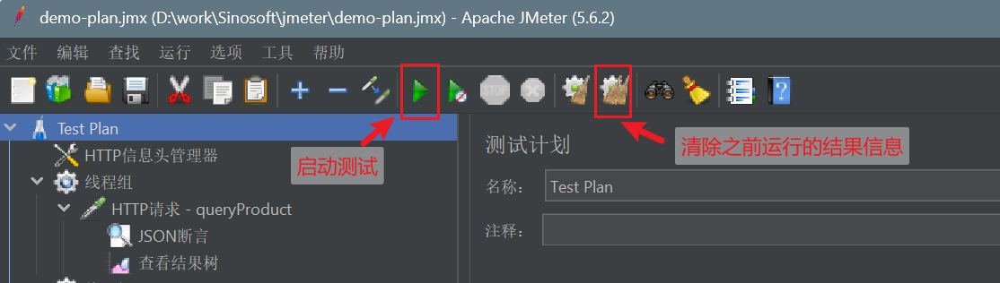
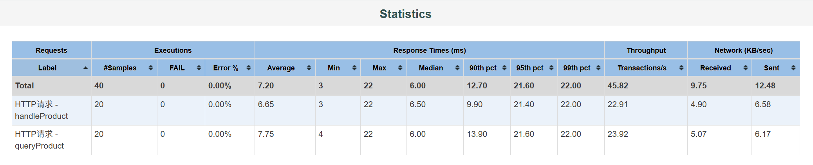

# 使用jmeter进行rest接口性能测试

本文将简单介绍如何使用jmeter对rest接口进行性能测试的方法，主要面向需要使用的测试或开发人员进行入门。

本文中的示例使用的是 JDK8 + jmeter 5.6.2 版本，但一般来说应该也适用于相近或更高版本的JDK和jmeter。

## 1. 安装jmeter

jmeter是基于java运行的，首先需要安装好Java(8以上版本)，并设置好JAVA_HOME等环境变量。

从官网 <https://jmeter.apache.org/download_jmeter.cgi> 下载jmeter软件，下载Binary版本，zip或tgz包均可。

下载后解压到任意目录，下文中将这个目录称为 $JMETER_HOME 目录。

jmeter一般先由测试人员本地使用图形化界面编辑脚本，然后再在本地或专用的测试服务器上使用命令实际执行压测。服务器上的安装方式也与本地类似，启动方式会有一定差异（第5章节介绍）。

## 2. 启动图形化界面

在Java已正常安装（`java -version`命令能显示大于8的版本）的前提下，直接运行 $JMETER_HOME/bin 目录下的 jmeter.bat 或者 jmeter.sh 脚本，即可启动jmeter图形化界面。默认打开的图形化界面应该只有一个空的 TestPlan 节点。

> 注：如果是英文界面，在菜单中 Options > Choose Language 可以选择语言。下文中的右键菜单等信息基本上是对应简体中文界面的。

## 3. 编写基本测试方案

jmeter的测试方案是一个树形结构，一般可以在节点鼠标右键菜单添加子节点，也可以拖动节点改变位置。点击某个节点后，右侧面板会显示该节点的相关配置。

右键菜单也可以对节点进行复制粘贴，禁用启用等。另外右键帮助会显示该节点的帮助文档（官网英文），可以查看这个节点相关配置项的说明。

> 注：查看帮助文档的时候，可以把官网地址中的 *jmeter.apache.org* 替换成 *www.jmeter.net* ，就可以查看对应的中文文档。

#### 作为示例的场景如下：

1. 一个复合场景，对系统中两个接口进行同时压测。
2. 其中一个接口（/product/queryProduct）为查询接口，POST方式传递查询条件，每次可以用相同的报文来调用。
3. 另一个接口（/product/handleProduct）为提交接口，预先整理了可提交的数据作为一个csv文件，每个业务单只提交一次。
4. 系统采用Http头信息来识别用户登录情况，开发人员已提前制作了一个固定的长时间有效登录token，压测时需要传这个token来作为登录认证信息。

> 示例的后端模拟应用为 test-app 工程，是一个spring-boot自启动工程，用于跑通测试计划，不含实际登录认证和存储等功能。可通过 `java -jar test-app.jar` 启动，控制台会显示请求信息。

#### 实际做出来的树形结构：

文件是 demo-plan.jmx ，可以在jmeter图形界面中打开查看


下面对逐个节点进行说明。

### 3.1 HTTP信息头管理器

通过右键 **添加 > 配置元件 > HTTP信息头管理器** 来添加，这个节点用来配置后续节点HTTP请求时要传递的HTTP头信息。由于当前场景下两个HTTP请求所需的头信息是相同的，因此我们把这个节点直接配置在Test Plan根节点下了。如果两个HTTP请求的头信息不同，可以把这个配置节点放在线程组下或者HTTP请求节点下。

这个节点的配置比较基础，就是把需要的HTTP头填进去。对于一般的Json-Rest服务来说，`Content-Type: application/json`是必须的，另外`Authorization`头用于传递之前场景中提到的登录token值，这里仅做示例，具体因应用而异。


### 3.2 线程组

通过右键 **添加 > 线程(用户) > 线程组** 来添加。线程组用来配置实际进行压测的线程。每个线程组代表一群用户，进行这个线程组下配置的操作。示例的压测场景是对两个接口同时执行压测，因此配置了两个线程组分别进行HTTP调用。如果把两个HTTP请求放到同一个线程组下，则执行的时候每个线程会先执行请求1再执行请求2，然后循环。具体如何配置需要根据实际场景而定。

常用属性：

- 线程数：即并发数。
- Ramp-Up时间：从测试开始到所有线程启动的时间，这个时间可以使线程启动前后错开，避免都集中在一起调用后端。
- 循环次数：每个线程执行次数，乘以线程数就是总共执行次数。
- 持续时间：一般在循环次数无限的场景下，选择持续执行多少时间。

一般在编写测试方案的时候会将线程组调整成1或者2线程，循环次数调整成1次或几次，以测试实际能否成功调用。编写验证通过后再配置成实际压力测试需要的线程数和循环次数。


### 3.3 HTTP请求

通过右键 **添加 > 取样器 > HTTP请求** 来添加。HTTP请求节点用于配置实际请求相关信息，如地址，Method，路径，请求报文等。

由于这里的场景是Json-Rest服务，因此用POST模式发送JSON格式的请求体数据。

HTTP请求节点的名称建议自行修改一下，每个请求起一个不重复且易识别的名称，实际测试生成的报告中会按这个名称来汇总报告。


### 3.4 JSON断言

通过右键 **添加 > 断言 > JSON断言** 来添加。断言一般是用来分析响应的数据，来判断服务调用是成功还是失败的。

这里假设返回的JSON是这样的结构，成功时status=200：

```json
{
  "status": 200,
  "message": "success",
  "data": []
}
```

失败时status=500或其他值：

```json
{
  "status": 500,
  "message": "校验失败"
}
```

添加的JSON断言只判断status值是否为200：


### 3.5 查看结果树

通过右键 **添加 > 监听器 > 查看结果树** 来添加。这个主要是用于编写测试方案时的调试验证用。在图形界面执行后，结果树面板中会显示所有请求/响应相关信息，可以查看调用是否成功，是否符合预期。


### 3.6 调试执行

先保存测试方案为一个jmx文件。

进行调试执行的时候一般建议先将线程组的线程数/循环数调小，如1线程执行1次之类。



点击图形界面工具栏上绿色三角箭头的 **启动** 按钮即可在图形界面进行执行。图形界面的执行一般用于调试测试方案，实际压测建议用命令行模式。点击 **启动** 后启动按钮会置灰，表示已经在运行了，等运行完成后会重新点亮。

执行过程中 **查看结果树** 的节点就会显示已发送的请求的相关信息了。

另外执行后，工具栏上两把扫帚的 **清楚全部** 按钮可以清空刚才产生的数据（如查看结果树中的请求信息）。

## 4. 编写测试方案-变量使用

在第3章中实现了一个基本的HTTP静态请求的调用。在实际场景中，纯静态的HTTP请求一般只能用于查询类的接口，对提交类的接口需要对请求数据进行变化。

jmeter测试可以通过添加变量的方式使请求变化，一般有如下几种场景：

1. **使用清单数据**：预先整理好一批可操作的数据，将接口调用所需的业务信息整理到一个csv文件中，然后每行转换成一个请求进行发送。
2. **生成随机数据**：某些业务接口可能会对如请求流水号之类的字段进行重复性校验，但不关注字段本身的含义。这类数据一般可以通过随机生成的方式来变化。
3. **连续接口调用**：某些接口是一个连续的流程，如先调用接口A，获得的返回数据中截取部分信息，再用这些返回的信息组装请求报文调用接口B。典型的如先保存后提交的场景。

### 4.1 使用清单数据

参考 demo-plan.jmx 文件中第二个线程组下的配置：


相比基本配置，多加了一个 **CSV数据文件设置** 节点，这个节点是通过右键 **添加 > 配置元件 > CSV Data Set Config** 来添加的，作用是让当前线程组每次执行的时候读取某个CSV文件中的行，并作为变量添加到上下文中。


> *demo-data.csv* 文件可在当前目录下找到，如果像图中这样指定相对位置，则要放在jmeter命令启动的目录下才行。

这个csv文件有两列，我们让他分别绑定到两个变量productNo和productName上，其他一些配置项需要根据实际csv文件格式（如分隔符，是否带引号等）以及实际使用场景（如是否允许循环）等进行配置。

然后在 **HTTP请求** 节点的请求体中，可以使用 `${productName}` 这样的表达式来使用变量填值。


运行一下实际查看结果树，可以看到每次请求发送的信息都是对应csv文件中不同行的内容。

### 4.2 生成随机数据

参考 demo-plan2.jmx 文件中第一个线程组下的配置：


相比基础配置，增加了一个 **JSR233预处理程序** 节点，该节点是通过右键 **添加 > 前置处理器 > JSR233 PreProcessor** 来添加的，用于在每次请求前执行一个脚本。


这里选择了groovy语言的脚本（groovy大概兼容90%的java语法，一般可以当作java来写。当然用其他支持的脚本语言也可以），使用 `java.util.UUID` 来生成随机码，然后用 `vars.put(key, value);` 设置变量。之后在 **HTTP请求** 节点配置的请求体中，用 `${transactionNo}` 来注入这个变量，实现每次请求的请求体使用随机生成的transactionNo的效果。


jmeter已经自带了不少jar包，比如常用的commons-lang3等。这些jar包中的类都可以在脚本中使用，例如可以改用commons-lang3的RandomStringUtils来生成随机码：

```java
String transactionNo = org.apache.commons.lang3.RandomStringUtils.randomAlphanumeric(20);
vars.put("transactionNo", transactionNo);
```

如果需要集成额外的jar包，需要自己加入 $JMETER_HOME/lib 目录里面，注意如果要在专门测试服务器上做jmeter压测的话，服务器的jmeter也需要安装对应jar包。

### 4.3 连续接口调用

参考 demo-plan2.jmx 文件中第二个线程组下的配置：


整个模拟场景是这样的，先通过 saveProduct 接口保存一个新产品，保存时后台程序会生成productNo并返回，然后再用返回的productNo调用 submitProduct 接口。

因此整个线程组下也是先后挂了两个 **HTTP请求** 节点，其中 saveProduct 节点下额外多了一个 **JSON提取器** 节点。这个节点是通过右键 **添加 > 后置处理器 > JSON提取器** 来添加的，用途是将返回信息JSON中某个属性取出来当作变量。


按上述配置，将返回报文中的 *data.productNo* 设置为一个叫 *productNo* 的变量，然后在之后的 **HTTP请求 - submitProduct** 中就可以使用这个变量了。


当然实际场景中，也有将以上三种方案混合起来编排的情况，具体需要根据实际接口的特性进行灵活分析。

## 5. 执行测试生成报告

编写完成测试方案，并在图形化界面中调试通过后，正式的压力测试一般建议在命令行执行。将测试方案保存成jmx文件，注意线程组的线程数/循环次数/持续时间等调整成实际测试方案需要的值，要依赖外部如csv文件的路径修改正确。

如果要在专用测试服务器上执行jmeter压测，将 jmx 文件及相关的 csv 文件等复制到执行测试的机器上。

> 注：专用测试服务器一般能避免一些网络不稳定的情况（用PC测试的话有可能会走办公网络，而服务器一般是走服务器内网，网速更高），不过一般建议要专门申请一个服务器或者借用一个暂时不使用的服务器来跑jmeter，而不要放在被测试应用相同的服务器上，jmeter进程本身也是有较大性能消耗的。

在PATH环境变量中配置 `$JMETER_HOME/bin` 目录，保证在任意位置都能正常调用 `jmeter.bat -h` 或 `jmeter.sh -h` 命令。

cd到存放jmx文件的目录作为当前工作目录。

执行命令（Windows）：

```sh
jmeter.bat  -t demo-plan.jmx -n -l demo-plan-result.csv -e -o report
```

执行命令（Linux前台执行）：

```sh
jmeter.sh  -t demo-plan.jmx -n -l demo-plan-result.csv -e -o report
```

执行命令（Linux Nohup 后台执行）：

```sh
nohup jmeter.sh  -t demo-plan.jmx -n -l demo-plan-result.csv -e -o report > nohup.log 2 > &1 &
```

命令中参数的含义如下：

- **-t**：指定测试方案文件，例如这里指定执行demo-plan.jmx文件
- **-n**：不使用图形化界面，纯命令行执行
- **-l**：指定结果输出文件名，这个文件是一个csv格式的中间结果，需要指定一个有写入权限但当前不存在或为空的文件（即重新执行时要把之前生成的文件删掉或拿走）
- **-e**：表示需要生成html结果报告
- **-o**：指定生成html结果报告的目录，需要指定一个有写入权限但当前不存在或为空的目录。

之后会开始执行压力测试，等待执行完成后，会生成 demo-plan-result.csv 文件和 report 目录，我们主要使用report目录中的html报告文件。

用浏览器打开report/index.html文件，可以查看结果报告。

其中最重要的是 Dashboard 中的 Statistics 表格，记录了每个HTTP请求的成功/失败数量，耗时，流通量（TPS）及网络流量信息。



另外 Charts 中 Response Time Over Time （响应耗时按时间的折线图）也可作为压测报告贴图。

## 6. 压测的一些其他相关内容

最后再补充简介一些与jmeter无关，属于压测本身的一些须知内容。

### 6.1 压测场景整理编排

压测前一般需要整理压测场景或用例，与常规的测试用例可能略有差异，一般会先整理个用例表格，包含如下这些字段信息：

1. **场景**：对应jmeter整个测试方案。可以指定一个抽象点的名称或编号，如“场景001”，一个场景可以包含多个流程，同一个场景下的每个流程都是同时一起压测的。
2. **流程**：这个对应到jmeter下就是线程组的概念，从业务上说就是表示一套完整的操作，比如录单，保存，提交，审核等。一个流程下可以含一个或多个接口，多个接口是依次串行的。
3. **并发数**：每个流程一般对应一个并发数，即jmeter中的线程数。
4. **接口**：实际要调用的接口名称或信息，这个是填接口名称还是地址可以由项目组自行确定，最终要让编写测试的同事能看懂要怎么调用接口。如有需要比如Method等信息也可以额外加列说明。
5. **请求处理方式**：描述请求报文是静态报文，还是需要动态处理等，最终也是需要让编写测试的同事能正确编写出请求信息。
6. **响应处理方式**：描述什么是正常响应，什么是异常响应，响应中有没有什么信息要记录成变量供后续接口使用等等。

其他一些可能在任意层级通用的信息，可以专门描述下：

1. **HTTP头信息**：请求应该发送怎样的HTTP头

### 6.2 应用端的一些改造配合

一般在压测前需要开发人员进行一下应用端的相关处理，常见的如：

1. **提供登录认证方式**：应用一般需要提供某种方式让压测接口可以正常通过认证，常用的如签发压测用的长效登录token等。
2. **外部接口Mock**：部分依赖外部系统的接口，如果不想被压测影响到，应该进行Mock处理（程序中直接Thread.sleep一定时间后写死返回值）。
3. **环境配置调整**：特别是测试环境，压测前需要对配置环境如内存大小等进行调整，以尽可能符合实际场景，让压测数据更加真实。
4. **数据准备**：部分场景需要预先造数据或提取数据。

### 6.3 系统监控信息获取

一般在压测进行过程中，需要对待测应用，以及与场景相关的数据库，NoSQL库（如Redis, ES, MongoDB等等），以及任何外置组件（如MQ等）进行性能监控（CPU/内存/IO等），以发现是否任何组件存在瓶颈。

待测应用如果是Java应用，一般可以用jmx等获取监控信息，数据库或外置组件相关的一般依赖相关组件的专门工具，或至少对服务器进行基本监控（如使用Linux的nmon工具监控下整个操作系统）。

### 6.4 应用性能调优

三方组件如数据库等的性能调优一般需要根据各组件专业的方案进行。这里简单介绍一下应用本身进行性能调优的一些基本思路：

#### 瓶颈点分析

进行一轮压测后可能会发现若干个接口性能达不到预期，这时最关键的步骤是进行瓶颈点分析，搞清除内部各段代码的耗时情况。

分析瓶颈点时比较常用的方式是打时间戳：

1. 最基本的，通过`System.currentTimeMillis()`获取系统时间，然后在多个地方加日志输出后获取日志进行分析。最好是在代码中直接减一下计算出耗时，减少分析时的工作量。
2. 进阶一点可以灵活利用spring-aop等功能来减少打时间戳的代码量，但不是所有代码都能走aop的，因此有一定限制。
3. 可以使用如perf4j等框架简化打时间戳的样板代码。
4. 可以使用javaagent方式非侵入式打时间戳信息（需要专门工具）

#### 常见造成性能问题的成因

找到瓶颈点后针对代码排查一下，是否存在如下这些可能情况：

1. SQL性能问题，例如查询语句全表扫描等。
2. 整存整取导致IO问题，如一个大对象每次都是从数据库/Redis等整存整取的，IO流量很大。
3. 不恰当的循环处理，比如循环中每次都执行某个操作，单次执行耗时不长，但循环多次就慢了。
4. 内存溢出，这个一般看应用的内存监控图表可以看出，如果内存持续居高不下，一般是临近OOM了，这时系统会变得很慢甚至无法响应。
5. 并发锁，相关代码是否可能涉及锁机制？包括java中的synchronized和其他类型的并发锁，Redis锁，以及SQL update可能导致的行级锁等等。
6. 反射相关，一般来说java反射性能还是可以的，但有时结合循环迭代等写法可能会慢，如果相关代码确实大量使用反射相关代码也可以关注下这方面可能性。
7. 磁盘/网络IO卡顿，有些情况会造成磁盘（如杀毒扫描或者某些虚拟机维护）或网络（如网络不稳定）IO卡顿或失败，有时在高压力下也会比较明显。不过这种一般来说应用并没有太好的优化方案。
